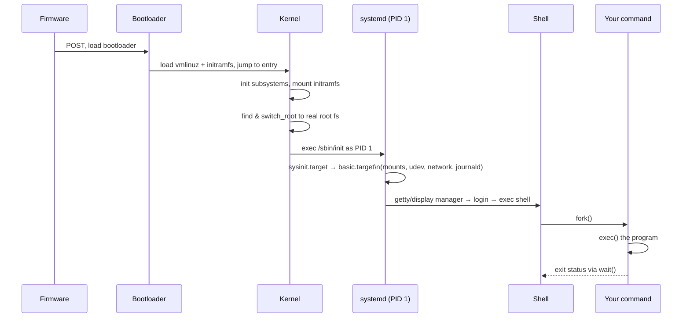

# How Linux Works — Technical Overview

A map of the Linux operating system from the hardware up: boot process, kernel subsystems, process/memory model, and the userland that sits on top. Each major section is written to stand alone but links out to deeper topics ([[Linux Boot Process]], [[Linux Process Management]], [[Linux Memory Management]], [[Linux Filesystems]], [[Linux Networking Stack]]) that you can expand into their own notes as you learn more.

---

## 1. The Big Picture

Linux is a **monolithic kernel** with **loadable module** support, originally written by Linus Torvalds in 1991. "Linux" strictly refers to the kernel itself; a full OS ("GNU/Linux" or a distro like Ubuntu, Fedora, Arch) pairs the kernel with:

- **GNU userland** (coreutils, bash, glibc) or alternatives (busybox, musl)
- An **init system** (systemd, OpenRC, runit) to boot userspace
- **Package managers** (apt, dnf, pacman) to install software
- A **display server** (Wayland/X11) and desktop environment, if graphical

```
┌─────────────────────────────────────────────┐
│         User Applications (bash, vim, ...)   │
├─────────────────────────────────────────────┤
│    System Libraries (glibc, libc, ...)       │
├─────────────────────────────────────────────┤
│         System Call Interface (syscalls)     │
├───────────────────────────────────────────── │
│                 KERNEL SPACE                 │
│  ┌───────────┬───────────┬────────────────┐  │
│  │ Process   │ Memory    │ VFS / File     │  │
│  │ Scheduler │ Manager   │ Systems        │  │
│  ├───────────┼───────────┼────────────────┤  │
│  │ Network   │ Device    │ IPC            │  │
│  │ Stack     │ Drivers   │ (pipes, signals│  │
│  │           │           │ , sockets)     │  │
│  └───────────┴───────────┴────────────────┘  │
├─────────────────────────────────────────────┤
│              Hardware (CPU, RAM, disk, NIC)  │
└─────────────────────────────────────────────┘
```

The kernel is the only piece of code running in **privileged (ring 0 / kernel) mode**. Everything else — even `init` (PID 1) — runs in **unprivileged (ring 3 / user) mode** and must ask the kernel to do anything that touches hardware, memory outside its own space, or other processes. That request mechanism is the **system call**.

---

## 2. Boot Process

1. **Firmware** — BIOS or UEFI performs POST (power-on self-test) and hands off to a bootloader.
2. **Bootloader** (GRUB, systemd-boot) — loads the kernel image (`vmlinuz`) and an initial RAM filesystem (`initramfs`) into memory, then jumps to the kernel entry point.
3. **Kernel init** — the kernel decompresses itself, initializes core subsystems (memory management, scheduler, interrupt handling), and mounts `initramfs` as a temporary root filesystem.
4. **initramfs** — contains just enough drivers/tools to find and mount the *real* root filesystem (e.g. it may need to load a RAID, LVM, or NVMe driver first).
5. **pivot_root / switch_root** — the kernel switches from the temporary root to the real root filesystem.
6. **PID 1** — the kernel executes `/sbin/init`, almost always **systemd** on modern distros. This is the first userspace process and the ancestor of every other process.
7. **systemd** brings up **targets** (roughly equivalent to old SysV runlevels) — mounting filesystems, starting network daemons, login managers, etc., in parallel where dependency graphs allow.

See [[Linux Boot Process]] for GRUB config, initramfs internals, and systemd unit ordering.

---

## 3. Processes and Scheduling

### Processes vs. threads
Every running program is a **process**, identified by a **PID**. Linux represents both processes and threads internally as `task_struct` entries — a thread is just a task that shares an address space with its parent (created via `clone()` with sharing flags, rather than `fork()`).

- **`fork()`** — duplicates the calling process (copy-on-write, so it's cheap until either side writes memory).
- **`exec()`** — replaces a process's memory image with a new program.
- **`wait()`** — a parent collects a child's exit status; an unreaped dead child is a **zombie**.
- Every process has a **parent**; if the parent dies first, the child is **reparented** to PID 1 (or a subreaper).

### Scheduling
The default scheduler since kernel 6.6 is **EEVDF** (Earliest Eligible Virtual Deadline First), replacing the older **CFS** (Completely Fair Scheduler). Both aim to give every runnable task a fair share of CPU time weighted by **nice value** (-20 to 19). Real-time tasks can instead use `SCHED_FIFO`/`SCHED_RR` policies, which preempt normal tasks entirely.

The kernel is **preemptible**: a higher-priority task (or a timer interrupt marking a time-slice as expired) can interrupt a running task at defined points, and the scheduler picks the next task to run on each CPU core.

### Signals and IPC
Processes communicate via:
- **Signals** (`SIGTERM`, `SIGKILL`, `SIGCHLD`, ...) — asynchronous notifications
- **Pipes / FIFOs** — byte streams between related/unrelated processes
- **Unix domain sockets** — bidirectional, can pass file descriptors
- **Shared memory** (`shmget`, `mmap` with `MAP_SHARED`) — fastest IPC, no copying
- **Message queues, semaphores** — classic System V / POSIX IPC

See [[Linux Process Management]] for `/proc` internals, cgroups, and namespaces (the building blocks of containers).

---

## 4. Memory Management

Linux gives every process the illusion of a full, private **virtual address space** (128 TiB+ on 64-bit). The **MMU** (memory management unit) translates virtual addresses to physical ones using **page tables** maintained by the kernel, in units of **pages** (typically 4 KiB, with "huge pages" of 2 MiB/1 GiB available).

Key mechanisms:
- **Copy-on-write (COW)** — after `fork()`, parent and child share physical pages read-only until one writes, at which point that page is duplicated.
- **Demand paging** — pages are only loaded into physical RAM when first accessed (a **page fault**), not when mapped.
- **Swap** — when RAM is under pressure, inactive pages are written to disk (or zram/zswap compressed memory) and reclaimed.
- **The page cache** — free RAM is used to cache file contents read from disk; this memory is reclaimed instantly under pressure, which is why `free -h` shows most RAM as "used" but it's mostly reclaimable cache.
- **OOM killer** — if the kernel truly cannot satisfy a memory request, it selects a process to kill based on an `oom_score` to free memory rather than deadlocking the system.

Address space layout (simplified, x86-64, per process):
```
0x7fff...  ┌────────────────┐  high addresses
           │  kernel space  │  (shared, not user-accessible)
           ├────────────────┤
           │  stack (grows ↓)│
           │       ...       │
           │  mmap region    │  (shared libs, mmap'd files)
           │       ...       │
           │  heap (grows ↑) │
           ├────────────────┤
           │  BSS / data     │  (globals)
           │  text (code)    │
0x0000...  └────────────────┘  low addresses
```

See [[Linux Memory Management]] for page tables, `/proc/meminfo`, and huge pages.

---

## 5. Filesystems and the VFS

Linux abstracts every filesystem (ext4, XFS, Btrfs, NFS, FAT, ...) behind the **Virtual File System (VFS)** layer, so `open()`/`read()`/`write()` work identically regardless of the underlying storage.

Core VFS objects:
- **superblock** — metadata about a mounted filesystem instance
- **inode** — metadata about one file/directory (permissions, size, timestamps, block pointers) — *not* its name
- **dentry** — a cached mapping from a name to an inode (this is why paths are fast to resolve)
- **file** — an open file's state (offset, flags) — this is what a **file descriptor** actually points to

**Everything is a file** is a core Unix/Linux philosophy: devices (`/dev/sda`), kernel interfaces (`/proc`, `/sys`), pipes, and sockets are all accessed through the same file-descriptor-based syscalls (`open`, `read`, `write`, `close`, `ioctl`).

Special filesystems worth knowing:
- **`/proc`** — a virtual filesystem exposing live kernel/process state (no disk backing)
- **`/sys`** — exposes the kernel's device model (drivers, buses, devices) for introspection and tuning
- **tmpfs** — RAM-backed filesystem (used for `/tmp`, `/dev/shm` on many distros)
- **overlayfs** — union filesystem layering a writable layer over read-only ones (used heavily by containers)

See [[Linux Filesystems]] for journaling, inodes vs. hard/soft links, and mount namespaces.

---

## 6. Devices and Drivers

Device drivers live in kernel space (or as **loadable kernel modules**, `.ko` files, loaded/unloaded with `insmod`/`modprobe`/`rmmod` without rebooting). Devices are exposed to userspace as:

- **Block devices** (`/dev/sda`) — random-access, buffered, e.g. disks
- **Character devices** (`/dev/tty`, `/dev/null`) — stream-like, unbuffered
- **udev** — a userspace daemon that listens to kernel `uevent`s and creates/removes `/dev` entries dynamically as hardware is added/removed, applying naming rules

Interrupts from hardware are handled in two halves: a minimal **top half** (interrupt handler) that acknowledges the interrupt and defers real work to a **bottom half** (softirq/tasklet/workqueue) that runs later, so the system stays responsive.

---

## 7. Networking Stack

Linux implements the full TCP/IP stack in-kernel, from the **network device driver** up through **IP** and **TCP/UDP** to the **socket API** userspace programs use (`socket()`, `bind()`, `connect()`, `send()`/`recv()`).

Notable kernel networking features:
- **netfilter/iptables/nftables** — packet filtering and NAT, the basis of most Linux firewalls
- **network namespaces** — give a process group its own isolated network stack (interfaces, routes, iptables rules) — the core primitive behind container networking
- **`tc` / traffic control** — queuing disciplines for shaping/prioritizing traffic
- **eBPF** — a way to safely run sandboxed, JIT-compiled programs *inside the kernel* at hook points (packet arrival, syscall entry, etc.) without writing a kernel module — powers modern observability (bpftrace), security (Falco), and networking (Cilium) tooling

See [[Linux Networking Stack]] for the socket buffer (`sk_buff`) lifecycle and netfilter hooks.

---

## 8. Namespaces, Cgroups, and Containers

Containers (Docker, Podman, LXC) are not a separate kernel feature — they're built from two primitives:

- **Namespaces** — isolate what a process *can see*: `pid` (its own process tree), `mnt` (its own mount table), `net` (its own network stack), `uts` (hostname), `ipc`, `user` (UID/GID mapping), `cgroup`.
- **Control groups (cgroups)** — limit and account for what a process *can use*: CPU shares, memory limits, block I/O bandwidth, device access. cgroup v2 unifies these under a single hierarchy.

A "container" is just a regular Linux process launched into a fresh set of namespaces with cgroup limits applied and (usually) an overlayfs root — there is no separate container kernel or hypervisor involved (unlike a VM, which virtualizes hardware and runs its own kernel).

---

## 9. The Boot-to-Shell Journey (putting it together)

1. Firmware → bootloader → kernel decompresses and initializes.
2. Kernel mounts initramfs, finds real root, `switch_root`s into it.
3. Kernel execs `/sbin/init` (systemd) as PID 1.
4. systemd starts units in dependency order: mounts, `udev` (device nodes appear), network, logging (`journald`), and eventually a **getty** (terminal login prompt) or a display manager (GUI login).
5. You log in → a **shell** (bash/zsh) is `exec`'d as your login process, reading `/etc/passwd` for your UID/GID and home directory.
6. Every command you type is: shell `fork()`s → child `exec()`s the program → shell `wait()`s for it → child's `stdin`/`stdout`/`stderr` are file descriptors 0/1/2, connected to your terminal (or piped/redirected).



---

## 10. Where to Go Deeper

- `man 7 <topic>` — overview man pages exist for nearly everything above: `man 7 namespaces`, `man 7 signal`, `man 7 vdso`
- **The kernel source**: `Documentation/` directory in the Linux source tree is extensive and current
- **`strace`/`ltrace`** — watch the actual syscalls a program makes
- **`/proc/<pid>/`** — poke around a live process's state directly
- Books: *The Linux Programming Interface* (Kerrisk), *Understanding the Linux Kernel* (Bovet & Cesati), *Linux Kernel Development* (Love)

---

## Related notes
- [[Linux Boot Process]]
- [[Linux Process Management]]
- [[Linux Memory Management]]
- [[Linux Filesystems]]
- [[Linux Networking Stack]]
- [[Linux Kernel Internals]]
