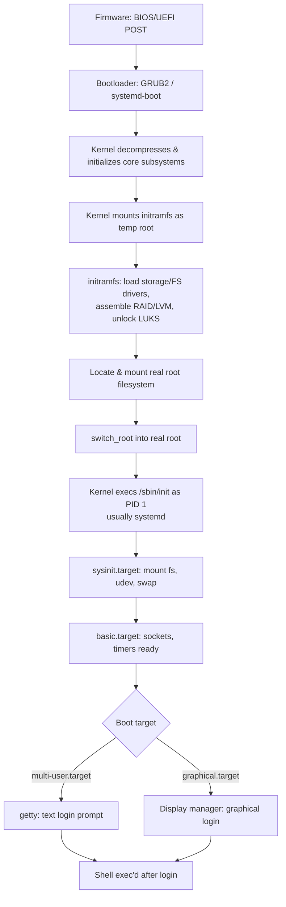

# Linux Boot Process

Deep dive into what happens between pressing the power button and getting a login prompt. Part of the [[How Linux Works]] series.



---

## 1. Firmware Stage

### BIOS (legacy)
- CPU starts executing firmware at a fixed address in ROM.
- **POST** (Power-On Self-Test) checks CPU, RAM, and attached devices.
- BIOS reads the **MBR** (Master Boot Record) — the first 512 bytes of the boot disk — which contains a tiny first-stage bootloader (446 bytes of code + partition table + boot signature).
- That code loads a larger second-stage bootloader.

### UEFI (modern)
- More capable: has its own driver model, can read FAT32 partitions directly, and executes `.efi` binaries.
- Reads boot entries from **NVRAM** (managed via `efibootmgr`) pointing at an **EFI System Partition (ESP)**, typically mounted at `/boot/efi`.
- Supports **Secure Boot**: the firmware verifies a cryptographic signature on the bootloader before running it, chaining trust down to the kernel (`shim` → `grub` → signed kernel).

---

## 2. Bootloader Stage (GRUB2)

GRUB (GRand Unified Bootloader) is the most common bootloader on Linux distros.

1. **grub.cfg** (generated by `grub-mkconfig` / `update-grub`) lists boot menu entries — each pointing to a kernel image and options.
2. GRUB loads the selected **kernel image** (`/boot/vmlinuz-<version>`) into memory.
3. GRUB loads the matching **initramfs** (`/boot/initrd.img-<version>`) into memory too.
4. GRUB passes a **kernel command line** (visible in `/proc/cmdline`) — e.g. `root=UUID=... ro quiet splash` — telling the kernel where the real root filesystem is and how verbose to be.
5. GRUB jumps to the kernel's entry point. Its job is now done.

Alternatives: **systemd-boot** (simpler, UEFI-only, used by many minimal distros), **rEFInd**, **syslinux/isolinux** (used on live/installer USB media).

---

## 3. Kernel Early Init

1. The kernel **decompresses itself** (kernels are typically gzip/zstd-compressed images).
2. Sets up basic CPU state: paging, exception vectors, per-CPU data.
3. Initializes core subsystems in a fixed order: memory allocator, scheduler data structures, interrupt controllers, timers.
4. Detects and initializes buses (PCI, USB) and probes for hardware, loading built-in drivers.
5. Mounts **initramfs** as a temporary root filesystem (this is an in-memory cpio archive that GRUB loaded — not a disk read at this point).

At this point the kernel has **no knowledge of your real disk layout** unless the driver for it is built directly into the kernel — this is exactly the problem initramfs solves.

---

## 4. initramfs (Initial RAM Filesystem)

Why it exists: the kernel may need modules to even *see* the root filesystem — e.g. NVMe drivers, RAID (`mdadm`) assembly, LVM activation, an encrypted volume (`cryptsetup`/LUKS) that needs a passphrase, or a network filesystem (PXE boot). None of that can happen after mounting root, because you need those drivers *to find* root.

Typical initramfs contents (built by `mkinitcpio`, `dracut`, or `update-initramfs` depending on distro):
- A minimal set of kernel modules (storage/filesystem drivers)
- `busybox` or similar for a minimal shell/utilities
- An `init` script that:
  1. Loads necessary kernel modules
  2. Assembles RAID/LVM/decrypts LUKS if needed
  3. Locates and mounts the real root filesystem (usually by UUID) at `/sysroot` or similar
  4. Calls `switch_root` (or the older `pivot_root`) to make that the new `/` and execs the real `/sbin/init`

You can inspect your own initramfs with:
```bash
lsinitramfs /boot/initrd.img-$(uname -r)   # Debian/Ubuntu
lsinitrd                                    # Fedora/RHEL (dracut)
```

---

## 5. switch_root and PID 1

- `switch_root` unmounts the old (initramfs) root, mounts the new root in its place, and `exec`s the target init — all without needing a full pivot mount-namespace dance (that's what `pivot_root` was for, mainly used when you need to keep the old root mounted somewhere).
- The kernel then runs `/sbin/init` (or whatever `init=` on the kernel command line specifies) as **PID 1**.
- PID 1 is special: it's the ancestor of every other process, and the kernel reparents orphaned processes to it (or to a designated "subreaper"). If PID 1 dies, the kernel panics — there's nothing above it to restart the system.

On virtually all modern mainstream distros, PID 1 is **systemd**.

---

## 6. systemd Startup

systemd organizes boot into **units** — services, mount points, devices, sockets, timers, and **targets** (which group other units, analogous to old SysV runlevels).

Common targets, in rough dependency order:
```
sysinit.target       — early setup: filesystems mounted, swap on, udev running
basic.target         — sockets, timers, path units ready
multi-user.target    — full non-graphical system (most servers stop here)
graphical.target     — adds a display manager (desktop systems)
```

Key mechanisms:
- **Unit files** (`/etc/systemd/system/*.service`, `/usr/lib/systemd/system/*.service`) declare a unit's dependencies (`Requires=`, `After=`, `Wants=`) and how to start/stop it.
- systemd builds a **dependency graph** and starts independent units **in parallel**, which is why systemd boots are typically much faster than serial SysV init scripts.
- **Socket activation**: systemd can create a listening socket for a service *before* starting it, and only actually launch the service on first connection — reducing boot-time work and startup ordering headaches.
- `systemd-udevd` runs early to populate `/dev` with device nodes as the kernel reports hardware (see [[Linux Filesystems]] for device nodes, [[How Linux Works]] §6 for the driver model).
- `journald` starts early to begin capturing kernel and service logs (`journalctl -b` shows the current boot's log).

Inspect boot ordering and timing on a live system:
```bash
systemd-analyze                # total boot time breakdown
systemd-analyze blame          # slowest-starting units
systemd-analyze critical-chain # the critical path that determined boot time
systemctl list-dependencies    # dependency tree for a target
```

---

## 7. Reaching a Login Prompt

- **Text mode**: systemd starts a `getty@tty1.service` (or several, for multiple virtual terminals), which prints a login prompt and runs `/bin/login` to authenticate you, then `exec`s your shell.
- **Graphical mode**: a **display manager** (GDM, SDDM, LightDM) is started as a systemd service, which draws a graphical login screen, authenticates via PAM, and starts your **session** — launching a Wayland compositor or X server plus your desktop environment.

At this point boot is complete and you're in normal interactive operation — see [[How Linux Works]] §9 for what happens when you actually run a command from your shell.

---

## Related notes
- [[How Linux Works]]
- [[Linux Process Management]]
- [[Linux Filesystems]]
