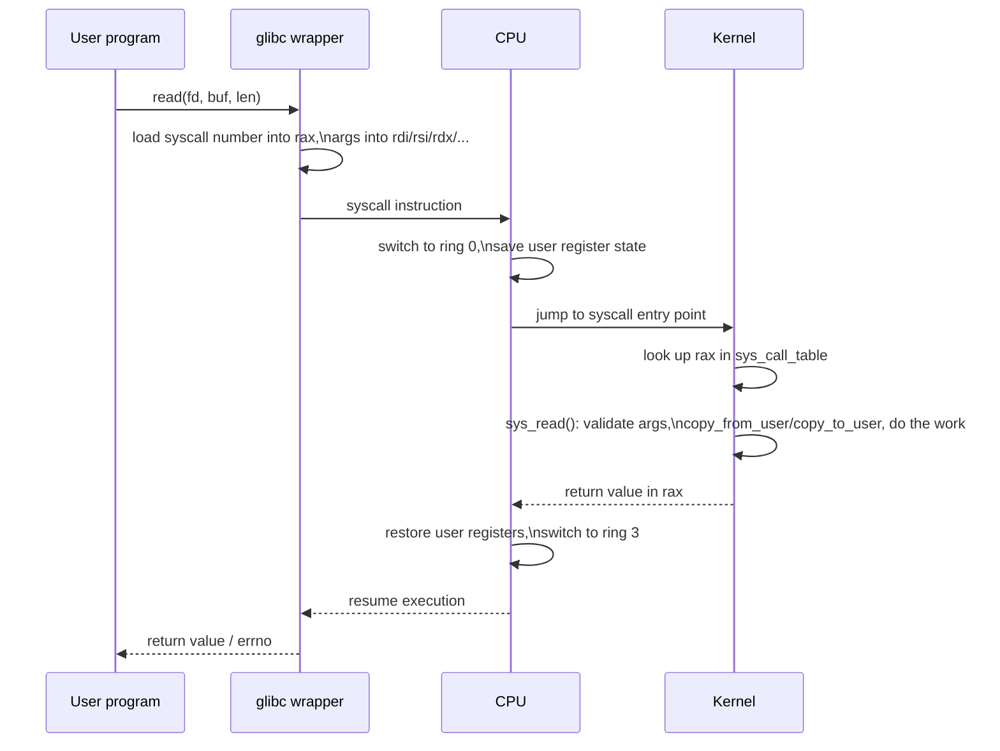

# Linux Kernel Internals

Fills the gaps left by the subsystem-focused notes: how a program actually crosses into the kernel, how the kernel protects shared data across CPUs, how interrupts are handled end-to-end, how loadable modules plug in, and how the kernel itself is built. Part of the [[How Linux Works]] series.

---

## 1. The Syscall Boundary

A **system call** is the only sanctioned way for user-space (ring 3) code to ask the kernel (ring 0) to do something — touch hardware, manage memory beyond your own space, or affect another process. Everything in [[Linux Process Management]], [[Linux Memory Management]], [[Linux Filesystems]], and [[Linux Networking Stack]] ultimately happens because some syscall was invoked.

### How a syscall actually executes (x86-64)
1. A program calls a libc wrapper, e.g. `read(fd, buf, len)`.
2. glibc places the syscall number in register `rax` and arguments in `rdi`, `rsi`, `rdx`, `r10`, `r8`, `r9` (fixed calling convention, not the regular C ABI registers).
3. It executes the `syscall` instruction — a fast trap into kernel mode (the older mechanism was a software interrupt, `int 0x80`; `syscall`/`sysenter` are faster because they avoid a full interrupt descriptor table lookup).
4. The CPU switches to ring 0, jumps to a fixed kernel entry point, and the kernel saves user registers, looks up `rax` in the **syscall table** (`sys_call_table`, an array of function pointers), and calls the matching handler, e.g. `sys_read()`.
5. The handler validates arguments (a syscall must never trust a pointer from user space without checking it — see `copy_from_user`/`copy_to_user`), does the actual work (possibly blocking, e.g. waiting on disk I/O), and returns a value in `rax`.
6. The CPU switches back to ring 3 and the libc wrapper returns to your program, translating a negative return value into `errno`.



### vDSO — avoiding the trap entirely
For a handful of very frequently called, cheap syscalls (`gettimeofday()`, `clock_gettime()`, `getcpu()`), the kernel maps a small shared library — the **vDSO** (virtual Dynamic Shared Object) — into every process's address space. glibc calls into this mapped code directly instead of trapping into the kernel at all, because the full ring-3→ring-0→ring-3 round trip is far more expensive than the computation itself for something like reading a timestamp. You can see it listed in `/proc/<pid>/maps` as `[vdso]`.

### Inspecting syscalls
```bash
strace -c ls           # count syscalls a command makes, by type
strace -e trace=openat cat file.txt   # trace just one syscall
ausyscall --dump        # list syscall numbers on this architecture
```

---

## 2. Synchronization Primitives

The kernel runs concurrently across multiple CPU cores and is preemptible, so shared data structures (run queues, page tables, the dentry cache, device driver state) need explicit protection against concurrent access. Different primitives trade off cost against what context they can be used in.

| Primitive | Blocks the caller? | Usable in interrupt context? | Typical use |
|---|---|---|---|
| **Spinlock** | No — busy-waits (spins) | Yes | Very short critical sections, especially where sleeping is unsafe |
| **Mutex** | Yes — sleeps if contended | No | Longer critical sections in process context |
| **Semaphore** | Yes — sleeps if contended | No | Like a mutex but allows N holders (counting semaphore) |
| **RCU** (Read-Copy-Update) | No, for readers | Yes, for readers | Extremely frequent reads, infrequent writes (e.g. routing tables) |
| **atomic_t / atomic ops** | No | Yes | Simple counters, flags — single-instruction updates |
| **seqlock** | No, for readers | Yes | Reader retries if a writer ran concurrently (good for rarely-written, often-read data like the system clock) |

**Why spinlocks matter**: an interrupt handler cannot sleep (there's no process context to reschedule back to in the same way), so any lock it takes must be a spinlock, not a mutex. This is a common source of kernel bugs — calling a sleeping-capable function while holding a spinlock, or from interrupt context, triggers a `BUG: sleeping function called from invalid context` splat in kernel logs.

**RCU** deserves special mention: it lets readers access a data structure with essentially zero synchronization overhead (no lock, no atomic instruction) by ensuring writers never mutate a structure in place — they build a new version and atomically swap a pointer, only freeing the old version once the kernel is sure no reader could still be using it (after a "grace period"). This is why RCU dominates in read-heavy, latency-sensitive kernel paths like the networking and filesystem layers.

---

## 3. Interrupt Handling in Depth

Referenced briefly in [[How Linux Works]] §6 and [[Linux Networking Stack]] §1 — here's the full picture.

### Top half / bottom half split
Hardware interrupts must be handled with interrupts disabled (or at least the same interrupt line masked) and as briefly as possible, since a long-running handler blocks other work on that CPU. Linux splits interrupt handling in two:

1. **Top half** (the actual interrupt handler, registered via `request_irq()`) — runs immediately, with strict time budget: acknowledge the device, copy the minimum data needed (e.g. grab a packet into a buffer), and schedule the rest of the work for later. Runs with (some) interrupts disabled.
2. **Bottom half** — the deferred, heavier processing, which runs with interrupts enabled and can be preempted. Three mechanisms, increasing in flexibility:
   - **Softirqs** — a fixed, small set of statically-defined deferred handlers (networking RX/TX, timers, tasklets themselves are built on softirqs) — the fastest bottom-half mechanism, but not dynamically created.
   - **Tasklets** — built on softirqs, but dynamically creatable by driver code; guaranteed to run on only one CPU at a time (unlike softirqs, which can run the same handler on multiple CPUs simultaneously).
   - **Workqueues** — deferred work that runs in **process context** (in a kernel thread), meaning it's allowed to sleep — necessary when the deferred work needs to allocate memory that might block, take a mutex, or wait on I/O.

### Threaded IRQs
Modern drivers increasingly use **threaded interrupt handlers** (`request_threaded_irq()`): a minimal top half plus a dedicated kernel thread for the real handler, giving the scheduler visibility and control (priority, CPU affinity) over interrupt processing — important for real-time systems where an interrupt storm on one device shouldn't be able to starve a high-priority real-time task.

### Inspecting interrupts
```bash
cat /proc/interrupts     # per-CPU interrupt counts, by IRQ line and device
cat /proc/softirqs        # per-CPU softirq counts, by type
watch -n1 cat /proc/interrupts   # watch which IRQs are firing live
```

---

## 4. Loadable Kernel Modules

Most drivers and some filesystems/subsystems can be compiled as **loadable kernel modules** (`.ko` files) rather than built statically into the kernel image, so they can be loaded/unloaded at runtime without a reboot.

```bash
lsmod                          # list currently loaded modules
modinfo e1000e                 # show a module's metadata (params, license, dependencies)
modprobe e1000e                # load a module (and its dependencies)
modprobe -r e1000e              # unload it
insmod ./mymodule.ko            # load a specific .ko file directly (no dependency resolution)
rmmod mymodule                  # unload by name
dmesg | tail                    # module load/unload messages, plus any errors it logs
```

A minimal module's skeleton:
```c
#include <linux/init.h>
#include <linux/module.h>

static int __init hello_init(void) {
    pr_info("hello: module loaded\n");
    return 0;
}

static void __exit hello_exit(void) {
    pr_info("hello: module unloaded\n");
}

module_init(hello_init);
module_exit(hello_exit);
MODULE_LICENSE("GPL");
```

Key points:
- Modules run in **kernel space** with full kernel privileges — a bug in a module can crash the whole system, unlike a bug in a userspace program.
- **`MODULE_LICENSE`** matters: the kernel's symbol exports are split into GPL-only and generally-available sets; a non-GPL module can't call GPL-only exported functions, and loading a non-GPL module also **taints** the kernel (visible in `cat /proc/sys/kernel/tainted` and in crash reports), signaling to kernel developers that a bug report might involve out-of-tree code.
- **Module signing**: with Secure Boot, the kernel can be configured to refuse loading unsigned modules, closing off a common rootkit technique (loading a malicious module to hide processes/files).

---

## 5. Kernel Source Tree and Build System

A rough map of `torvalds/linux` (or any distro's kernel source):

```
arch/           — architecture-specific code (x86, arm64, riscv, ...)
kernel/         — core kernel: scheduler, signals, cgroups, timers, module loading
mm/             — memory management (page allocator, page cache, swap)
fs/             — the VFS layer and individual filesystem drivers (ext4/, xfs/, ...)
net/            — the networking stack (ipv4/, ipv6/, netfilter/, core/)
drivers/        — the vast majority of the source tree — device drivers, by category
include/        — public and internal headers
Documentation/  — extensive, current documentation for nearly every subsystem
tools/          — userspace tools shipped alongside the kernel (perf, bpftool, ...)
```

The kernel is configured via **Kconfig** (`make menuconfig`, `make defconfig`), producing a `.config` file that decides what's built statically (`=y`), as a module (`=m`), or excluded (not set) — this is why kernels for a phone, a server, and a Raspberry Pi can come from the exact same source tree but end up wildly different in size and included drivers. The build itself uses **Kbuild**, a set of Makefiles layered on top of GNU Make.

```bash
uname -r                        # currently running kernel version
cat /boot/config-$(uname -r)    # the .config this running kernel was built with
zcat /proc/config.gz            # same, if the kernel exposes it live
```

Version scheme: `MAJOR.MINOR.PATCH` (e.g. `6.11.4`) — since the 2.6 era there's no more even/odd stable-vs-development split; instead each MAJOR.MINOR is a stable release that then gets PATCH-level bugfix/security updates, with some marked **LTS** (Long Term Support, maintained for years) for distros and embedded use.

---

## Related notes
- [[How Linux Works]]
- [[Linux Process Management]]
- [[Linux Memory Management]]
- [[Linux Filesystems]]
- [[Linux Networking Stack]]
- [[Linux Boot Process]]
