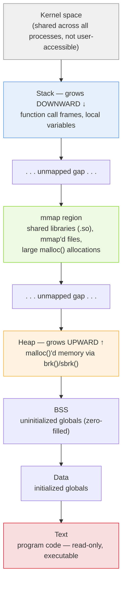
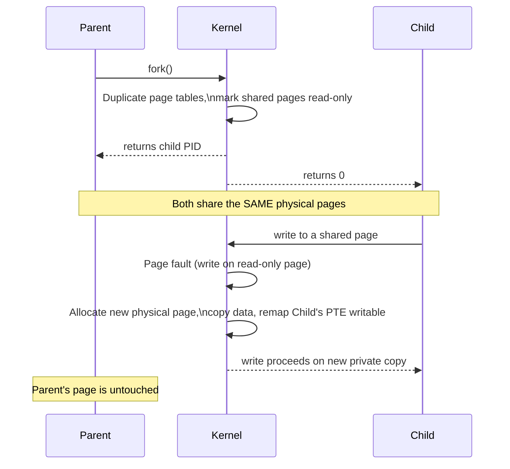

# Linux Memory Management

Deep dive into virtual memory, paging, and how Linux decides what stays in RAM. Part of the [[How Linux Works]] series.

---

## 1. Virtual Memory — The Core Idea

Every process gets its own **virtual address space**, independent of physical RAM layout. This buys three things:

1. **Isolation** — one process cannot read or corrupt another's memory (barring shared mappings it explicitly opted into).
2. **Simplicity** — every process can assume it has a large, contiguous address space starting near address 0, regardless of what's physically free.
3. **Overcommit / flexibility** — the kernel can map the same physical page into multiple processes (shared libraries, copy-on-write), or back virtual memory with disk (swap) instead of RAM.

The **MMU** (Memory Management Unit, in hardware) translates a virtual address to a physical one on every memory access, consulting **page tables** that the kernel maintains per-process. A hardware cache of recent translations, the **TLB** (Translation Lookaside Buffer), avoids walking the full page table on every access — a **TLB flush** (needed on context switch, since each process has different mappings) is one of the hidden costs of a context switch.

Memory is managed in fixed-size **pages** — 4 KiB on x86-64 by default, with optional **huge pages** (2 MiB or 1 GiB) that reduce TLB pressure for large allocations like databases and VMs.

---

## 2. Address Space Layout

For a typical 64-bit process:

```
0x7fff_ffff_ffff  ┌────────────────────┐
                  │   (unmapped gap)    │  kernel-reserved, not addressable by user code
                  ├────────────────────┤
                  │   stack (grows ↓)   │  function call frames, local variables
                  ├────────────────────┤
                  │        ...          │
                  │  mmap region        │  shared libraries (.so), mmap'd files,
                  │  (grows ↓, usually) │  anonymous mmap allocations (large mallocs)
                  │        ...          │
                  ├────────────────────┤
                  │   heap (grows ↑)    │  malloc()'d memory (via brk()/sbrk() or mmap)
                  ├────────────────────┤
                  │   BSS                │  uninitialized globals (zero-filled)
                  ├────────────────────┤
                  │   Data               │  initialized globals
                  ├────────────────────┤
                  │   Text (code)        │  the executable's machine code, read-only
0x0000_0000_0000  └────────────────────┘
```


*Top = highest address (`0x7fff...`), bottom = lowest (`0x0000...`). Stack and heap grow toward each other across the mmap region; ASLR (below) randomizes each region's base on every exec.*

You can see this laid out precisely for any process via `cat /proc/<pid>/maps`, which lists every mapped region with its permissions (`r`/`w`/`x`), backing file (if any), and offset. `pmap <pid>` gives a friendlier summary.

**ASLR** (Address Space Layout Randomization) randomizes the base of the stack, heap, and mmap region on each exec to make memory-corruption exploits harder to write reliably.

---

## 3. Demand Paging and Page Faults

When a process calls `mmap()` or when `exec()` maps a binary into memory, the kernel typically does **not** immediately load any data into physical RAM — it just creates page table entries marked "not present." The first access to such a page triggers a **page fault**, trapping into the kernel, which then:

- **Minor fault** — the data is already in RAM somewhere (e.g. page cache, or a COW source page) and the kernel just needs to update the page table. Cheap.
- **Major fault** — the data must actually be read from disk (a file-backed page not yet cached, or a swapped-out page). Expensive — this is the fault type that shows up as `majflt` in `/proc/<pid>/stat` and correlates with visible slowness.

This is why a freshly `exec`'d large binary starts running before its entire code is "loaded" — pages are faulted in as execution reaches them.

---

## 4. Copy-on-Write (COW)

After `fork()`, parent and child share the **same physical pages**, each marked read-only in both page tables. If either process writes to such a page:

1. The write triggers a page fault (the MMU sees a write attempt on a read-only page).
2. The kernel allocates a new physical page, copies the data, updates that process's page table to point at the new page (now writable), and lets the write proceed.
3. The other process is untouched and still points at the original page.

This means `fork()` is cheap regardless of process size — the copy only happens for the specific pages that are actually modified, and often (in the common `fork()`+`exec()` pattern) almost nothing gets copied before `exec()` replaces the whole address space anyway.



---

## 5. The Page Cache

Free RAM that isn't actively used by processes doesn't sit idle — Linux uses it to cache the contents of files read from disk, in the **page cache**. This is why `free -h` on a healthy Linux box shows most memory as "used": most of that is cache, reported separately as reclaimable.

```
$ free -h
              total   used   free   shared  buff/cache  available
Mem:           16Gi   3.2Gi  1.1Gi   400Mi      11Gi        12Gi
```

- **`available`** is the number that matters for "how much can a new process actually get" — it accounts for cache the kernel can instantly evict.
- Writes go through the page cache too: a `write()` typically just updates the cached page and marks it **dirty**; a background flusher thread (or an explicit `fsync()`) writes dirty pages back to disk asynchronously, which is why `write()` returning doesn't guarantee durability.
- `sync`, `fsync()`, and `O_DIRECT` are the tools for controlling exactly when/whether the cache is bypassed or flushed.

---

## 6. Swap and Reclaim

When free memory (and easily-reclaimable cache) runs low, the kernel's **reclaim** logic kicks in:

1. **Clean page cache pages** are dropped first — they're free to evict since the data is still on disk.
2. **Dirty pages** are written back to disk, then dropped.
3. **Anonymous memory** (heap/stack pages with no file backing, i.e. a process's actual working data) can only be reclaimed by writing it to **swap** — a dedicated disk partition/file, or increasingly **zswap**/**zram** (a compressed in-RAM swap area, much faster than disk).
4. Pages are chosen for eviction using an approximate **LRU** (least-recently-used) scheme, split into active/inactive lists.

Tuning knobs:
- **`vm.swappiness`** (0-200, default 60) — how aggressively the kernel prefers swapping anonymous pages vs. reclaiming cache. Low values favor keeping processes fully in RAM.
- **`vm.overcommit_memory`** — controls whether the kernel allows `malloc`/`mmap` to succeed for more virtual memory than physically exists (default: heuristic overcommit — most allocations "succeed" and are only backed by real pages on first write).

---

## 7. The OOM Killer

If reclaim and swap can't free enough memory to satisfy an allocation, and overcommit already promised more memory than exists, the kernel has no way to fail gracefully — it invokes the **OOM (Out-Of-Memory) killer**, which:

1. Scans running processes and computes an `oom_score` for each, weighted by memory usage and adjustable per-process via `/proc/<pid>/oom_score_adj`.
2. Sends `SIGKILL` to the highest-scoring process to free memory immediately.

This is why a runaway process sometimes just vanishes with no error message on a memory-starved system — check `dmesg` or `journalctl -k` for `Out of memory: Killed process ...` to confirm the OOM killer fired.

---

## 8. Kernel Memory vs. User Memory

Everything above describes **user-space** virtual memory. The kernel has its own memory needs — page tables themselves, `task_struct`s, network buffers (`sk_buff`s, see [[Linux Networking Stack]]), filesystem caches (inode/dentry caches) — allocated via slab allocators (`SLUB` being the modern default) that efficiently manage fixed-size object pools. `/proc/slabinfo` and `slabtop` expose this. Kernel memory is generally **not swappable** the way user anonymous memory is (with some exceptions like reclaimable slab caches), which is part of why a kernel memory leak is more dangerous than a userspace one.

---

## Related notes
- [[How Linux Works]]
- [[Linux Process Management]]
- [[Linux Filesystems]]
