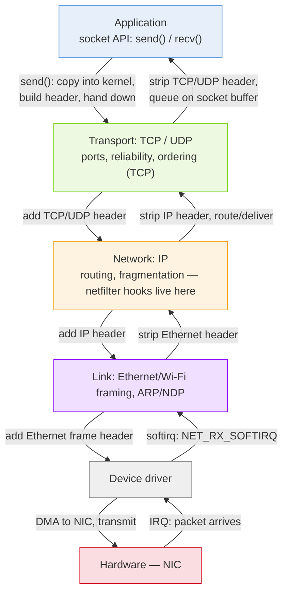
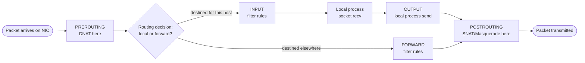

# Linux Networking Stack

Deep dive into how Linux moves packets from a network card up to an application's socket, and the tools built on top. Part of the [[How Linux Works]] series.

---

## 1. Layered Overview

Linux implements the full network stack in-kernel, mirroring the classic layers:

```
┌───────────────────────────────────────┐
│  Application (socket API: send/recv)   │
├───────────────────────────────────────┤
│  Transport: TCP / UDP                  │
├───────────────────────────────────────┤
│  Network: IP (routing, fragmentation)  │
│  netfilter hooks live here too         │
├───────────────────────────────────────┤
│  Link: Ethernet/Wi-Fi framing, ARP     │
├───────────────────────────────────────┤
│  Device driver (NIC)                   │
├───────────────────────────────────────┤
│  Hardware (network card)               │
└───────────────────────────────────────┘
```

A packet arriving on the wire triggers a hardware interrupt; the NIC driver's interrupt handler does minimal work (grab the packet into a buffer) and defers the rest to a **softirq** (`NET_RX_SOFTIRQ`), which walks the packet up through IP and transport-layer processing before it's queued on a socket's receive buffer for a userspace `recv()` to pick up. Sending is the reverse: `send()` copies data into the kernel, which builds headers layer by layer and hands the finished frame to the driver for transmission.


*Each layer going down **prepends** its own header to the same `sk_buff` (see §3) without copying the payload; each layer going up **strips** its header before passing the packet further up. netfilter hooks (§5) sit inside the IP layer's path in both directions.*

---

## 2. The Socket API

Userspace programs never touch raw network hardware — they go through **sockets**, a file-descriptor-based abstraction (fitting the "everything is a file" model, see [[Linux Filesystems]]):

```c
int fd = socket(AF_INET, SOCK_STREAM, 0);  // TCP socket
connect(fd, &addr, sizeof(addr));
send(fd, buf, len, 0);
recv(fd, buf, len, 0);
close(fd);
```

- **`AF_INET`/`AF_INET6`** — IPv4/IPv6 networking
- **`AF_UNIX`** — Unix domain sockets, for local IPC (see [[Linux Process Management]] §4) — same API, no actual network stack involved
- **`SOCK_STREAM`** — TCP: reliable, ordered, connection-oriented byte stream
- **`SOCK_DGRAM`** — UDP: unreliable, unordered, connectionless datagrams

A listening TCP server additionally uses `bind()` (claim a port), `listen()` (mark it as accepting connections), and `accept()` (block until a client connects, returning a new socket for that connection).

---

## 3. sk_buff — The Packet's Journey

Every packet moving through the kernel is represented by a **`sk_buff`** ("socket buffer") structure — a self-describing buffer with headroom reserved at each end so headers can be prepended/stripped as the packet moves between layers without copying the payload. As a packet travels up the stack (driver → IP → TCP → socket), each layer strips its own header by adjusting pointers into the same buffer; going down, each layer prepends its header the same way. This zero-copy-where-possible design is central to Linux networking performance.

---

## 4. IP Layer: Routing

The IP layer decides, for every outgoing packet, which interface and next-hop to send it through, consulting the **routing table**:

```bash
ip route show                # view the routing table
ip route get 8.8.8.8         # show which route would be used for a destination
ip addr show                 # show interface addresses
```

For LAN delivery, **ARP** (IPv4) or **NDP** (IPv6) resolves an IP address to a MAC address so the link layer can frame the packet correctly. **Fragmentation** splits packets larger than a link's MTU (Maximum Transmission Unit); **Path MTU Discovery** tries to avoid this by finding the smallest MTU along a route ahead of time.

---

## 5. netfilter — Firewalling and NAT

**netfilter** is a framework of hook points inside the kernel's IP stack (`NF_INET_PRE_ROUTING`, `NF_INET_LOCAL_IN`, `NF_INET_FORWARD`, `NF_INET_LOCAL_OUT`, `NF_INET_POST_ROUTING`) where registered callbacks can inspect, modify, or drop a packet as it passes through. This is the foundation of:

- **iptables** / **ip6tables** — the traditional (now legacy, but still ubiquitous) rule-based firewall/NAT tool, organized into tables (`filter`, `nat`, `mangle`) and chains (`INPUT`, `OUTPUT`, `FORWARD`, ...)
- **nftables** — the modern replacement, a single unified tool/syntax replacing iptables/ip6tables/arptables/ebtables, generally faster and easier to reason about
- **firewalld**, **ufw** — higher-level, distro-provided front ends over nftables/iptables

**NAT** (Network Address Translation) — rewriting source/destination addresses/ports — is implemented as netfilter hooks too, which is how a home router (or a Docker bridge network) lets many internal hosts share one public IP.



Each box is a **netfilter hook point**; `iptables`/`nftables` rules attach to one of these chains, which is why a firewall rule's placement (INPUT vs. FORWARD vs. PREROUTING) determines whether it applies to traffic destined for the host itself, routed through it, or being NATed.

```bash
nft list ruleset             # view current nftables rules
iptables -L -n -v             # view current iptables rules (legacy)
```

---

## 6. Network Namespaces

Introduced in [[Linux Process Management]] §5: a **network namespace** gives a process (or group of processes) its own completely isolated network stack — interfaces, IP addresses, routing table, iptables/nftables rules, even its own loopback. Two processes in different network namespaces can each bind port 80 without conflict.

This is the core primitive behind container networking:
- A container typically gets its own network namespace with a **veth pair** (a virtual Ethernet cable) — one end inside the namespace, the other attached to a bridge on the host — connecting it to the outside world.
- Docker's default bridge network, Kubernetes' pod networking (CNI plugins), and `systemd-nspawn` all build on exactly this mechanism.

```bash
ip netns add mynet                          # create a network namespace
ip netns exec mynet ip addr show            # run a command inside it
ip link add veth0 type veth peer name veth1 # create a veth pair
```

---

## 7. Traffic Control (tc)

The **`tc`** subsystem attaches **queuing disciplines (qdiscs)** to network interfaces, controlling how outgoing packets are queued, reordered, delayed, or dropped — used for bandwidth shaping, prioritization (e.g. keeping interactive SSH traffic responsive under a large upload), and network emulation (`netem` can simulate latency, jitter, and packet loss for testing).

```bash
tc qdisc add dev eth0 root netem delay 100ms  # simulate 100ms latency
tc qdisc show dev eth0                         # view current qdisc
```

---

## 8. eBPF — Programmable Kernel Networking

**eBPF** (extended Berkeley Packet Filter) lets a verified, sandboxed, JIT-compiled program run *inside the kernel* at defined hook points, without writing a kernel module. For networking specifically:

- **XDP** (eXpress Data Path) — runs a program at the earliest possible point, right as a packet arrives at the driver, before the kernel has even allocated a full `sk_buff` — used for extremely fast packet filtering/dropping (DDoS mitigation) or redirection.
- **TC-BPF** — attaches eBPF programs at traffic-control hook points for more flexible filtering/shaping than a static qdisc.
- **Socket-level eBPF** (`SO_ATTACH_BPF`, `sockmap`) — used for fast in-kernel proxying, e.g. by Cilium for Kubernetes networking without traditional iptables-based kube-proxy rules.

The kernel's **eBPF verifier** statically proves a program can't crash, loop forever, or access memory out of bounds before allowing it to load — this safety guarantee is what makes it acceptable to run arbitrary user-supplied logic in kernel context.

Tools built on eBPF worth knowing: `bpftrace` (scripting/tracing), `bcc` tools, `cilium`/`Hubble` (Kubernetes networking + observability), `falco` (runtime security).

---

## 9. DNS and Name Resolution

Name resolution (`example.com` → an IP) usually happens in **userspace**, not the kernel — via `glibc`'s resolver (`getaddrinfo()`) consulting `/etc/nsswitch.conf`, `/etc/hosts`, and configured DNS servers (`/etc/resolv.conf`, often now managed by `systemd-resolved`). The kernel networking stack only ever sees the resolved IP address; DNS lookups themselves are ordinary UDP/TCP traffic over port 53 from a userspace library.

---

## Related notes
- [[How Linux Works]]
- [[Linux Process Management]]
- [[Linux Filesystems]]
