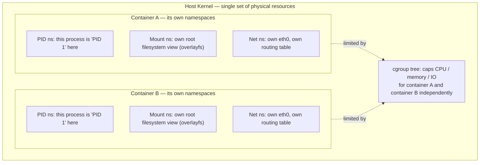

# Linux Process Management

Deep dive into processes, threads, scheduling, and the isolation primitives (namespaces/cgroups) built on top of them. Part of the [[How Linux Works]] series.

---

## 1. What a Process Actually Is

Internally, the kernel represents every process (and every thread) as a `struct task_struct`. It holds, among hundreds of fields:

- **PID** (process ID) and **TGID** (thread group ID — all threads in a process share one TGID, which is what `getpid()` actually returns)
- **State**: `Running`, `Runnable` (ready but waiting for CPU), `Interruptible sleep` (waiting, can be woken by a signal), `Uninterruptible sleep` (waiting on I/O, the classic "D state" that resists `kill`), `Zombie`, `Stopped`
- Pointers to its **memory descriptor** (`mm_struct` — see [[Linux Memory Management]]), open **file descriptor table**, **credentials** (UID/GID), **signal handlers**, and **namespaces**
- Scheduling info: priority, nice value, scheduling policy, accumulated runtime

You can see live `task_struct` data reflected in `/proc/<pid>/` — `status`, `stat`, `maps`, `fd/`, `cgroup`, etc.

### fork(), exec(), wait()
The classic Unix process-creation trio:

```
pid_t pid = fork();     // duplicate the calling process
if (pid == 0) {
    // child: replace this image with a new program
    execve("/bin/ls", argv, envp);
} else {
    // parent: block until the child exits
    int status;
    waitpid(pid, &status, 0);
}
```

- `fork()` duplicates the address space **copy-on-write** — no actual memory copy happens until one side writes to a shared page, making `fork()` cheap even for large processes.
- `exec()` (family: `execve`, `execvp`, ...) discards the current process image and loads a new binary in its place, keeping the same PID and open file descriptors (unless marked `close-on-exec`).
- `wait()`/`waitpid()` lets a parent retrieve a child's exit status. A child that has exited but hasn't been `wait()`-ed for is a **zombie** — it holds no resources except a slot in the process table, but a huge pile of zombies can exhaust the max PID count.
- If a parent dies before its child, the child is **reparented**, typically to PID 1 or to whichever ancestor called `prctl(PR_SET_CHILD_SUBREAPER)` (this is how process supervisors like `systemd`, `tini`, or `s6` reap orphans in containers).

### clone() and threads
`fork()` is actually implemented in terms of the more general `clone()` syscall, which takes flags controlling exactly what's shared with the new task: address space (`CLONE_VM`), file descriptor table (`CLONE_FILES`), signal handlers (`CLONE_SIGHAND`), filesystem info (`CLONE_FS`), and more. A "thread" (as created by `pthread_create`) is just `clone()` with all of these sharing flags set — which is why Linux sometimes describes its model as "everything is a task," with processes and threads differing only in *how much* they share.

---

## 2. Scheduling

Linux is **preemptive multitasking**: the kernel can interrupt a running task to run another one, based on priority and time-slice expiry, without the task's cooperation.

### Scheduling classes
Tasks are scheduled under one of several policies:
- **`SCHED_NORMAL`/`SCHED_OTHER`** — the default for ordinary processes, governed by **EEVDF** (Earliest Eligible Virtual Deadline First, kernel 6.6+) or the older **CFS** (Completely Fair Scheduler) on earlier kernels. Both try to give each task a "fair" share of CPU proportional to its weight (derived from **nice value**, -20 highest priority to +19 lowest).
- **`SCHED_FIFO`** / **`SCHED_RR`** — real-time policies. A `SCHED_FIFO` task runs until it blocks or yields; it will always preempt a normal task. `SCHED_RR` is the same but with a time-slice round-robin among equal-priority real-time tasks.
- **`SCHED_DEADLINE`** — Earliest-Deadline-First scheduling for tasks with hard timing requirements (period/deadline/runtime budget).

### The run queue and load balancing
Each CPU core has its own run queue. The scheduler periodically **load-balances** tasks across cores to keep utilization even, while trying to respect **CPU affinity** (`taskset`, `sched_setaffinity`) and cache locality (keeping a task on the core whose cache still holds its working set).

### Context switches
A context switch — saving one task's CPU register state and restoring another's — happens when:
- A timer interrupt fires and the current task's time slice is up
- The running task blocks (e.g. waiting on I/O, a lock, or `sleep()`)
- A higher-priority task becomes runnable and preemption is enabled

Context switches aren't free — they cost cache/TLB locality — which is part of why the scheduler tries to minimize unnecessary migrations.

Inspect scheduling in practice:
```bash
chrt -p <pid>          # show/set a process's scheduling policy and priority
nice -n 10 <cmd>        # start a process with a lower priority
renice -n -5 -p <pid>   # change a running process's niceness (root for negative values)
taskset -c 0,1 <cmd>    # pin a process to specific CPU cores
```

---

## 3. Signals

Signals are the oldest Linux/Unix async-notification mechanism — a small integer delivered to a process, optionally with a handler function it registered via `sigaction()`.

Common signals:
| Signal | Default action | Notes |
|---|---|---|
| `SIGTERM` (15) | Terminate | The "polite" kill — catchable, so processes can clean up |
| `SIGKILL` (9) | Terminate | Uncatchable, unblockable — kernel just tears the process down |
| `SIGINT` (2) | Terminate | Sent by Ctrl-C |
| `SIGHUP` (1) | Terminate | Originally "line hung up"; daemons often reinterpret it as "reload config" |
| `SIGCHLD` (17/20) | Ignore | Sent to a parent when a child exits/stops |
| `SIGSTOP`/`SIGCONT` | Stop/Continue | Uncatchable pause/resume (Ctrl-Z uses `SIGTSTP`, the catchable version) |
| `SIGSEGV` (11) | Terminate + core dump | Invalid memory access |

A process can **block**, **ignore**, or **handle** most signals, but not `SIGKILL`/`SIGSTOP`. This is why `kill -9` (`SIGKILL`) is a last resort — it gives the target zero chance to flush buffers or release locks.

---

## 4. Inter-Process Communication (IPC)

| Mechanism | Direction | Notes |
|---|---|---|
| Anonymous pipe (`pipe()`) | One-way | Only between related processes (e.g. shell `\|`) |
| Named pipe / FIFO | One-way | `mkfifo`, works between unrelated processes via the filesystem |
| Unix domain socket | Two-way | Can pass open file descriptors between processes (`SCM_RIGHTS`) — used heavily by systemd, D-Bus, Docker |
| Shared memory (`mmap`/`shmget`) | N/A (shared) | Fastest IPC — no kernel copy — but needs external synchronization (semaphores, futexes) |
| Message queues (POSIX/SysV) | One-way, queued | Structured messages with priorities |
| Signals | One-way, async | See above — for notification, not data transfer |

---

## 5. Namespaces — Isolating What a Process Sees

A namespace wraps a global kernel resource so a process (and its descendants) sees its own isolated instance of it. Created with `clone()`/`unshare()` flags, entered with `setns()`.

| Namespace | Isolates |
|---|---|
| `pid` | Process IDs — a process can be PID 1 inside its namespace and some other PID outside it |
| `mnt` | Mount points — a process's own view of the filesystem tree |
| `net` | Network interfaces, routing tables, iptables rules, ports |
| `uts` | Hostname and NIS domain name |
| `ipc` | System V IPC objects and POSIX message queues |
| `user` | UID/GID mappings — lets a process be "root" inside the namespace but an unprivileged user outside it |
| `cgroup` | The cgroup root a process sees |
| `time` | Boot/monotonic clocks (for checkpoint/restore and containers) |

You can inspect a process's namespaces via `/proc/<pid>/ns/` (each entry is a symlink whose inode number identifies the namespace — two processes with the same inode number for `net` are in the same network namespace).

```bash
lsns                      # list all namespaces on the system
unshare --pid --fork bash # start a new shell in its own PID namespace
nsenter -t <pid> -n bash  # enter another process's network namespace
```

---

## 6. Control Groups (cgroups) — Limiting What a Process Can Use

Where namespaces control *visibility*, cgroups control *resource consumption*. cgroup v2 (the current unified hierarchy, mounted at `/sys/fs/cgroup`) organizes processes into a tree, where each node can set limits inherited by its children:

- **`cpu`** — CPU shares/weight, hard bandwidth caps (`cpu.max`)
- **`memory`** — hard/soft limits, OOM behavior for that group specifically
- **`io`** — block I/O bandwidth/IOPS limits per device
- **`pids`** — caps the number of processes/threads a group can create (prevents fork bombs)
- **`cpuset`** — pins a group to specific CPU cores/NUMA nodes

Every process belongs to exactly one cgroup per hierarchy at a time; `systemd` itself uses cgroups to organize every service, user session, and scope it manages — run `systemd-cgls` to see the live tree. **Namespaces + cgroups together are the entire mechanism behind containers** — see [[How Linux Works]] §8.



Namespaces answer *"what can this process see?"*; cgroups answer *"how much can it use?"* — a container is nothing more than an ordinary process launched into a fresh combination of both.

---

## Related notes
- [[How Linux Works]]
- [[Linux Boot Process]]
- [[Linux Memory Management]]
- [[Linux Networking Stack]]
